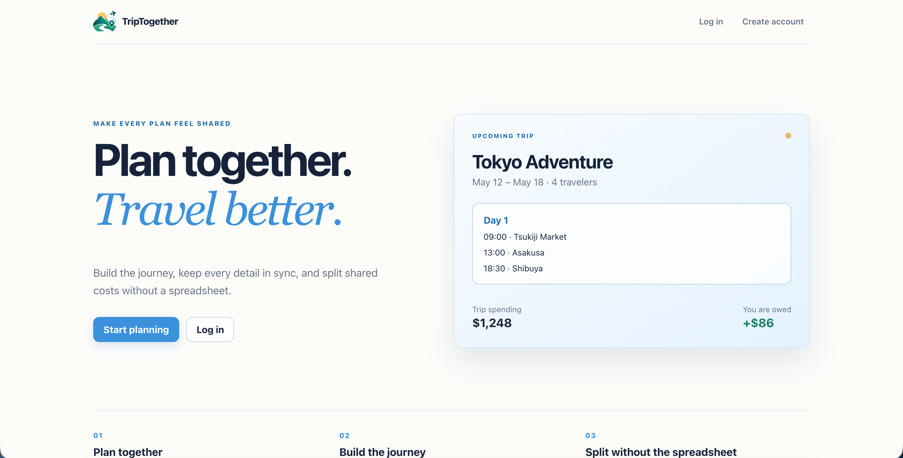
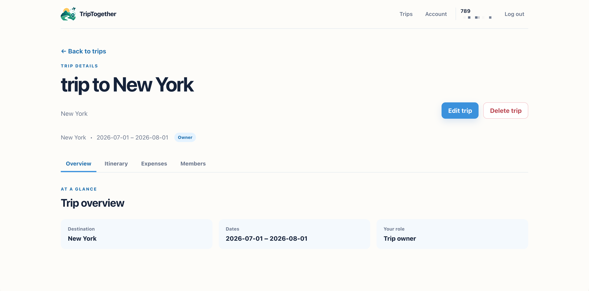
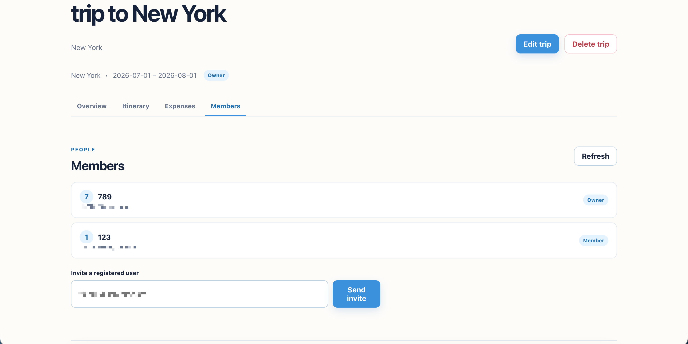
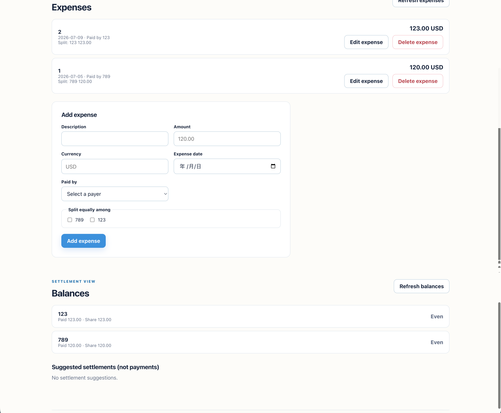

# TripTogether

> A collaborative travel planning web application for shared itineraries, group expenses, and settlement tracking.

TripTogether is a full-stack collaborative travel-planning application for small groups. It keeps a trip's people, itinerary, shared expenses, balances, and settlement suggestions in one workspace.

## Overview

This is a deployed portfolio MVP. The application deliberately keeps the domain small: plan together, travel together, and settle fairly.

**Live Demo:** [TripTogether](https://trip-together-zeta.vercel.app) · [API health](https://triptogether-api.onrender.com/health)

## Features

- Register and log in with JWT authentication.
- Create, edit, delete, and join trips through invitations.
- Maintain a shared, date-grouped itinerary with create, edit, delete, and reorder actions.
- Record exact-decimal expenses with equal splits.
- View server-derived balances and suggested settlement transfers.
- Use responsive pages with loading, empty, error, confirmation, and success feedback.

## Tech Stack

**Frontend:** React, TypeScript, Vite, React Router, Vitest, Testing Library, ESLint.

**Backend:** FastAPI, SQLAlchemy, PostgreSQL, Alembic, pytest, httpx.

**Authentication:** JWT and Argon2id password hashing.

**Deployment:** Vercel (frontend), Render (FastAPI), and Render PostgreSQL.

## Architecture

```text
React SPA → REST API → FastAPI → Service Layer → SQLAlchemy → PostgreSQL
```

The browser renders backend-provided exact monetary strings; it never recomputes equal splits or balances.

## Core Workflow

Create Trip → Invite Members → Shared Itinerary → Track Expenses → Calculate Balances → Settlement Suggestions

## Local Development

Requirements: Python 3.9+, Node 24 LTS, npm, and a running PostgreSQL instance.

```bash
python3 -m venv .venv
source .venv/bin/activate
python -m pip install -r backend/requirements.txt
cp -n .env.example .env
cd backend
python -m alembic upgrade head
CORS_ORIGINS='["http://127.0.0.1:5173","http://localhost:5173"]' python -m uvicorn app.main:app --reload
```

In a second terminal:

```bash
cd frontend
npm ci
cp -n .env.example .env
npm run dev -- --host 127.0.0.1 --port 5173 --strictPort
```

Open `http://127.0.0.1:5173`.

## Environment Variables

The root `.env` configures the server: `DATABASE_URL`, `JWT_SECRET_KEY`, `JWT_ALGORITHM`, `ACCESS_TOKEN_EXPIRE_MINUTES`, `APP_ENV`, and `CORS_ORIGINS`. Use a strong local JWT key and never commit it.

`frontend/.env.example` contains only `VITE_API_BASE_URL`. All `VITE_*` values are bundled for the browser and are public configuration. Do not put database URLs, passwords, or JWT signing secrets there.

## Deployment

TripTogether is deployed with a static frontend build, a non-reloading FastAPI process, and hosted PostgreSQL. The browser calls the backend's public HTTPS origin; the backend connects to PostgreSQL through its private connection string. The project owner confirmed production registration after migration to `0005 (head)`.

```text
Browser → static frontend → public HTTPS API → hosted PostgreSQL
```

Development uses `npm run dev`, `uvicorn --reload`, and a local PostgreSQL instance. Production uses `npm run build`, a static web server, `uvicorn app.main:app --host 0.0.0.0 --port "$PORT"` without `--reload`, and hosted PostgreSQL. A production frontend must be rebuilt whenever `VITE_API_BASE_URL` changes because Vite embeds it in the generated browser bundle.

### Production Environment Variables

| Variable | Used by | Production requirement |
| --- | --- | --- |
| `DATABASE_URL` | Backend | PostgreSQL `postgresql+psycopg://...` URL supplied by the host/provider. |
| `JWT_SECRET_KEY` | Backend | Unique secret of at least 32 bytes; never use the example placeholder. |
| `JWT_ALGORITHM` | Backend | `HS256`. |
| `ACCESS_TOKEN_EXPIRE_MINUTES` | Backend | Integer between 1 and 1440; current project variable name. |
| `APP_ENV` | Backend | `production`, which validates database and JWT configuration on startup. |
| `CORS_ORIGINS` | Backend | JSON array of exact HTTPS frontend origins, with no trailing slash. |
| `VITE_API_BASE_URL` | Frontend build | Public HTTPS backend origin only; it is safe to expose but must not contain credentials. |

Keep these values in the deployment platform's secret/configuration store. `.env` is local-only and ignored by Git; `.env.example` and `frontend/.env.example` contain placeholders only.

### Migration and Startup Strategy

Run `alembic upgrade head` once as a controlled release step for a new database
or schema update, before validating business traffic. Do not let every backend
replica run migrations on boot. Render Free does not offer a Pre-Deploy Command:
run the migration manually from a trusted environment with the Render database
URL supplied through an environment variable, then verify `alembic current`
reports `0005 (head)`. Never paste the URL into a committed file or shell
command history. After the migration succeeds, start the API without reload:

```bash
cd backend
APP_ENV=production python -m alembic upgrade head
APP_ENV=production /path/to/venv/bin/python -m uvicorn app.main:app --host 0.0.0.0 --port "${PORT:-8000}"
```

`/health` is a liveness endpoint and does not require database access. `/ready`
validates JWT configuration, PostgreSQL connectivity, the current Alembic head,
and all seven core tables. It returns 503 until the schema is complete, so use
it for readiness checks after migrations finish.

### CORS

Never use a wildcard origin for production. Configure the exact deployed frontend URL, for example:

```bash
CORS_ORIGINS='["https://app.example.com"]'
```

The backend rejects non-HTTPS origins when `APP_ENV=production`. The Docker Compose simulator below runs on HTTP localhost, so it intentionally defaults to `APP_ENV=development` while still using non-reloading production processes. Set `APP_ENV=production` only behind HTTPS with HTTPS origins.

### Docker

Docker files use the repository root as the build context so `.dockerignore` excludes local secrets, dependencies, build output, caches, and AppleDouble metadata. The backend image does not copy `.env` and starts Uvicorn without reload. The frontend image uses a Node build stage and serves `dist` with Nginx, including SPA route fallback.

For a local production-process simulation, copy the examples and set only local placeholder-free values:

```bash
cp -n .env.example .env
# In .env set a strong JWT_SECRET_KEY, a URL-safe POSTGRES_PASSWORD,
# CORS_ORIGINS='["http://127.0.0.1:5173"]', APP_ENV=development,
# and VITE_API_BASE_URL=http://127.0.0.1:8000.
docker compose up --build
```

Compose starts `postgres`, runs the one-shot `migrate` job, then starts `backend` and `frontend`. Open `http://127.0.0.1:5173`; the frontend reaches the host-exposed backend at `http://127.0.0.1:8000`. Stop the simulator with `docker compose down`; add `-v` only when deliberately deleting its local database volume.

### Local Production Simulation Without Docker

With a migrated local PostgreSQL database, build the frontend with an explicit API URL and start both production processes without reload:

```bash
cd frontend
VITE_API_BASE_URL=http://127.0.0.1:8000 npm run build
npm run preview -- --host 127.0.0.1 --port 4173 --strictPort

# Separate terminal
cd backend
APP_ENV=development CORS_ORIGINS='["http://127.0.0.1:4173"]' \
  /path/to/venv/bin/python -m uvicorn app.main:app --host 127.0.0.1 --port 8000
```

Verify `/health`, `/ready`, registration, login, trip creation, invitations, itinerary changes, expenses, balances, and settlement suggestions. Use the existing PostgreSQL verification scripts for disposable end-to-end test data.

### Platform Configuration: Vercel + Render

The frontend runs on Vercel with `frontend` as the Root Directory,
Node `24.x`, `npm run build`, and `dist` as the Output Directory.
`frontend/vercel.json` rewrites all paths to `index.html`, preserving direct
React Router access to `/login`, `/register`, `/trips`, `/account`, and
`/trips/:id`.

The backend runs on a Render Python Web Service with `backend` as the
Root Directory, build command `pip install -r requirements.txt`, start command
`uvicorn app.main:app --host 0.0.0.0 --port $PORT`, and HTTP health check
`/ready`. Use Render Postgres's internal connection URL when both services are
in the same region. Standard provider `postgres://` and `postgresql://` URLs
are normalized to the project's `postgresql+psycopg` driver at the config
boundary; local development URLs continue to work unchanged.

Render's Free Postgres tier is useful for a short-lived prototype, but it
expires after 30 days and has no backups. A paid Render Postgres plan is the
recommended persistent portfolio choice. Neon Postgres is a simple lower-cost
prototype alternative after reviewing its current plan limits. See the
[deployment checklist](docs/deployment-checklist.md) for the exact manual
sequence, secret handling, migration procedure, CORS sequence, and smoke test.
The complete Step 20A handoff, including the Render/Vercel fields and
troubleshooting flow, is in the [production deployment runbook](docs/step20-production-deployment.md).

## Testing

```bash
# frontend
cd frontend
npm test
npm run lint
npm run typecheck
npm run build

# backend
cd ../backend
python -m pytest -q
RUN_POSTGRES_TESTS=1 python -m pytest -q

# opt-in real PostgreSQL / FastAPI checks from repository root
/private/tmp/triptogether-step1-venv/bin/python frontend/scripts/verify_auth.py
/private/tmp/triptogether-step1-venv/bin/python frontend/scripts/verify_trips.py
/private/tmp/triptogether-step1-venv/bin/python frontend/scripts/verify_collaboration.py
/private/tmp/triptogether-step1-venv/bin/python frontend/scripts/verify_finance.py
```

The verification scripts create random disposable users and clean them up. They require a migrated PostgreSQL database; they never substitute SQLite.

## Known Limitations

- No OAuth, refresh tokens, payments, maps, booking, chat, or live updates.
- Logout clears the local token; server-side revocation is not implemented.
- Backend authorization remains the source of truth; hidden browser controls are UX only.

See [known limitations](docs/known-limitations.md) and the [Step 17 learning review](docs/step17-review.md).

## Frontend Experience

The React client now uses a consistent, light-blue travel workspace: a compact application shell, a preview-led landing page, focused authentication cards, responsive trip cards, and a tabbed Trip Detail workspace. The four detail tabs separate the overview, shared itinerary, expenses and balances, and members without changing routes or API calls.

The design keeps the existing functional states visible: loading and error messages use semantic status roles, empty dashboards point users to the relevant next action, invitations retain server-authorized actions, and financial values are rendered directly from backend responses. Buttons, fields, cards, tabs, and member rows share the same spacing, borders, focus treatment, and mobile breakpoints.

## Screenshots

Real screenshots from the production application:

### Landing Page



### Trip Overview



### Trip Members



### Expenses & Balances



## Future Improvements

Future work may include rate limiting, token revocation, observability, real-browser accessibility testing, and CI. These are outside this hardening task.
